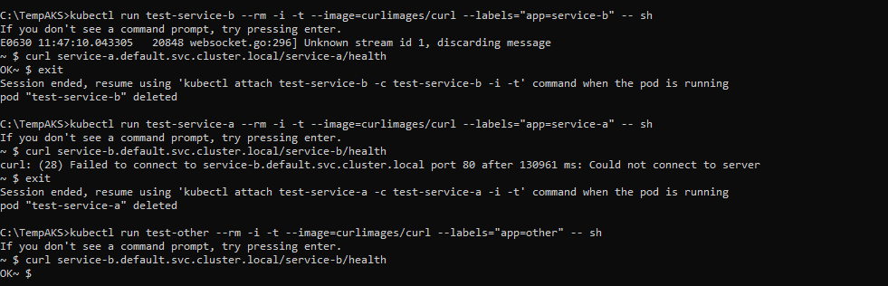

# ⚙️ SRE Home Assignment – Kubernetes Bitcoin Tracker

> ✅ Submitted by Saja Abu Krenat — SRE Kubernetes Home Assignment

---

## 📌 Overview

This assignment provisions a **production-ready AKS (Azure Kubernetes Service)** cluster using Azure CLI. It deploys two services (**Service A** and **Service B**) with proper ingress routing, RBAC, readiness/liveness probes, and a network policy that isolates Service B from Service A.
**Service A** retrieves and logs Bitcoin prices periodically using a public API.

---

## 📁 Project Structure

```
🔍 manifests/
│   ├── deny-service-a-to-b-networkpolicy.yaml
│   ├── service-a-deployment.yaml
│   ├── service-a-ingress.yaml
│   ├── service-a-service.yaml
│   ├── service-b-deployment.yaml
│   ├── service-b-ingress.yaml
│   └── service-b-service.yaml
├── service-a/
│   ├── app.py
│   ├── tracker.py
│   ├── templates/
│   │   └── index.html
│   ├── requirements.txt
│   └── Dockerfile
├── service-b/
│   ├── app.py
│   ├── requirements.txt
│   └── Dockerfile
├── cluster-create.sh
└── README.md
```

## ☁️ AKS Cluster Setup

The cluster was created using the following Azure CLI command:

```bash
az aks create \
  --resource-group sre-home-assignment-rg \
  --name bitcoin-k8s-cluster \
  --node-count 1 \
  --enable-addons monitoring \
  --ssh-key-value <path-to-your-id_rsa.pub> \
  --load-balancer-sku standard \
  --node-vm-size Standard_B2ms \
  --network-plugin kubenet \
  --network-policy calico \
  --location eastus
```

### 🔍 Parameter Rationale

| Parameter                      | Justification                                                                                                                                                                                      |
| ------------------------------ | -------------------------------------------------------------------------------------------------------------------------------------------------------------------------------------------------- |
| `--node-count 1`               | Enough to support 2 microservices for this assignment, minimizes cost. My Azure Free Subscription also limits available cores and VM quotas, preventing allocation of separate nodes for each pod. |
| `--enable-addons monitoring`   | Ensures cluster observability using Azure Monitor.                                                                                                                                                 |
| `--load-balancer-sku standard` | Required for Calico and future scalability.                                                                                                                                                        |
| `--node-vm-size Standard_B2ms` | Budget-friendly VM with sufficient CPU/memory for our services.                                                                                                                                    |
| `--network-plugin kubenet`     | Lightweight, compatible with Calico and default for custom policies.                                                                                                                               |
| `--network-policy calico`      | Enables defining network policies to restrict cross-service communication.                                                                                                                         |
| `--ssh-key-value`              | Allows secure admin access if troubleshooting is needed.                                                                                                                                           |

---

## 🚀 Services Overview

### 🔹 Service A

* Python app that:

  * Fetches Bitcoin value (USD) from a public API [Coingecko API](https://api.coingecko.com/api/v3/simple/price?ids=bitcoin&vs_currencies=usd) every minute
  * Logs the current value
  * Calculates and logs the average every 10 minutes
* Exposes:

  * `/` → Web UI
  * `/data` → JSON price data
  * `/health` → Health check endpoint
* Includes **liveness** and **readiness** probes

### 🔹 Service B

* Simple Flask web service
* Exposes:

  * `/service-b/health` → for ingress & network policy testing
* Includes **liveness** and **readiness** probes

---

## 🌐 Ingress Controller & Routing

The NGINX Ingress Controller was deployed using:

```bash
kubectl apply -f https://raw.githubusercontent.com/kubernetes/ingress-nginx/controller-v1.10.1/deploy/static/provider/cloud/deploy.yaml
```

### Ingress Rules

* `http://4.246.244.95/service-a/` → Service A
* `http://4.246.244.95/service-b/` → Service B

---

## 🔒 Network Policy

A Calico-based `NetworkPolicy` is applied to **deny communication from Service A to Service B**:

* External traffic to both services via ingress
* Blocks internal traffic **from Service A → Service B**

---

## ❤️ Health Probes

Both services include:

```yaml
readinessProbe:
  httpGet:
    path: /health
    port: 5000
  initialDelaySeconds: 5
  periodSeconds: 10

livenessProbe:
  httpGet:
    path: /health
    port: 5000
  initialDelaySeconds: 10
  periodSeconds: 15
```

(Service B uses port 5001)

---

## 🧲 How to Test

1. Deploy the cluster using `cluster-create.sh`

2. Apply all manifests from `manifests/` directory

3. Access:

   * `http://4.246.244.95/service-a/`
   * `http://4.246.244.95/service-b/`

4. Verify network policy behavior with 3 test cases:

### Test 1: Service A → Service B (should be blocked)

```bash
kubectl run test-service-a --rm -i -t --image=curlimages/curl --labels="app=service-a" -- sh
curl service-b.default.svc.cluster.local/service-b/health
```

**Expected:** ❌ Connection blocked (network policy in effect)

### Test 2: Service B → Service A (should be allowed)

```bash
kubectl run test-service-b --rm -i -t --image=curlimages/curl --labels="app=service-b" -- sh
curl service-a.default.svc.cluster.local/service-a/health
```

**Expected:** ✅ Connection allowed, response `OK`

### Test 3: Other pod → Service B (should be allowed)

```bash
kubectl run test-other --rm -i -t --image=curlimages/curl --labels="app=other" -- sh
curl service-b.default.svc.cluster.local/service-b/health
```

**Expected:** ✅ Connection allowed



---

## 🧼 Cleanup

To stop the cluster and reduce costs:

```bash
az aks stop --name bitcoin-k8s-cluster --resource-group sre-home-assignment-rg
```